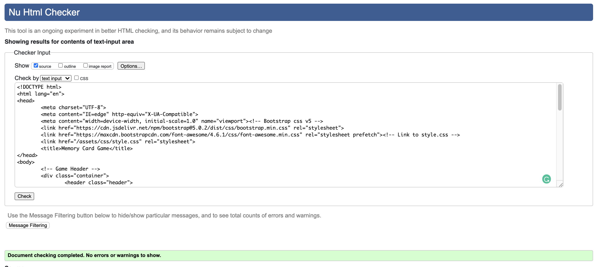

<h1 align="center">Memory Cartoon Game</h1>

[View the live project here.](https://philipwilliams0.github.io/MemoryGame/)

> Memory cartoon game is a fictional memory game to challenge the mind.

## <h2 align="center"></h2>

## User Experience (UX)

- ### User stories

  - #### As a user i want:
  - Through the design, create an invitation to play and navigate the game instinctively.
  - To persuade and influence the user to have multiple turns.
  - To test and improve memory skills in an entertaining and enjoyable way.
  - Clear scoring when the user completes the game in order to make progress and improve outcome.

- ### Strategy

  The goal is to create a simple, fun game that challenges the person to try again.

- ### Scope

  Feature that should be within the project:

  - Header with name
  - timer for time taken to complete
  - move counter for the amount of moves taken.

- ### Structure

A mockup was created within "Balsamiq Wireframes". Some changes made while creating the game: arrangement of buttons, game cards layout, window with game results.

- #### Color Scheme

  - Colors used
  -  `#ffcc44`
  -  `#53c7fb`
  -  `#ffffff`

- #### Typography

  - I’ve chosen [Poppins](https://fonts.google.com/specimen/Poppins?query=poppin)
    Poppins is one of the Geometric sans serif typefaces that have been a popular design tool for building websites. Each letterform is nearly monolinear, with optical corrections applied to stroke joints were necessary to maintain an even typographic colour.

- #### Imagery

I’ve chosen [CLEANPNG](https://www.cleanpng.com/)
Due to the size requirements of the type of image.

- ### Wireframes

  - To create the wireframes for my game I used balsamiq, just so easy to create mockups quickly and clearly.

  The wireframes include:

  - Desktop Wireframe - [View](assets/wireframe/DesktopWireframe.png)

  - Tablet Wireframe - [View](assets/wireframe/TabletWireframe.png)

  - Mobile Wireframe - [View](assets/wireframe/PhoneWireframe.png)

- ### Features

  - its a memory, but I want the user to be challenged not only by the number of cards but also the time and amount of moves to complete all flips.

  - As it's a game format, I don't want links/navbar, but rather icons with popups using recently learned JavaScript.

  - Responsive on all device sizes

  - Interactive elements

## Technologies Used

### Languages Used

- [HTML5](https://en.wikipedia.org/wiki/HTML5)
- [CSS3](https://en.wikipedia.org/wiki/Cascading_Style_Sheets)
- [JavaScript](https://en.wikipedia.org/wiki/JavaScript)

### Frameworks, Libraries & Programs Used

1. [Bootstrap 5.0.0:](https://getbootstrap.com/docs/5.0/getting-started/introduction/)
   - Bootstrap was used to assist with the responsiveness and styling of the website.
1. [Google Fonts:](https://fonts.google.com/)
   - Google fonts were used to import the 'Lato' font into the style.css file which is used on all pages throughout the project.
1. [Font Awesome:](https://fontawesome.com/)
   - Font Awesome was used on all pages throughout the website to add icons for aesthetic and UX purposes.
1. [Git](https://git-scm.com/)
   - Git was used for version control by utilizing the terminal to commit to Git and Push to GitHub.
1. [GitHub:](https://github.com/)
   - GitHub is used to store the projects code after being pushed from Git.
1. [balsamiq:](https://balsamiq.com/)
   - Balsamiq was used to create the [wireframes](#) during the design process.

## Testing

The W3C Markup Validator and W3C CSS Validator Services were used to validate the project to ensure there were no syntax errors in the project.

- [W3C Markup Validator](https://jigsaw.w3.org/css-validator/#validate_by_input)

    <h2 align="center"></h2>

- [W3C CSS Validator](https://jigsaw.w3.org/css-validator/#validate_by_input)

    <h2 align="center"></h2>

- [jslint](https://www.jslint.com/)

   <h2 align="center"></h2>

   <h2 align="center"></h2>

### Testing User Stories from User Experience (UX) Section

- #### Testing User Stories

  1. Through the design, create an invitation to play and navigate the game instinctively.
  <h2 align="center"></h2>
  2. To persuade and influence the user to have multiple turns.
  <h2 align="center"></h2>
  3. To test and improve memory skills in an entertaining and enjoyable way.
  <h2 align="center"></h2>
  4. To test and improve memory skills in an entertaining and enjoyable way.
  <h2 align="center"></h2>

- ##### Frequent User Goals

### Further Testing

- The Website was tested on Google Chrome, Internet Explorer, Microsoft Edge and Safari browsers.
- The website was viewed on a variety of devices such as Desktop, Laptop, iPhone SE, iPhone 8 & iPhoneX.

### Known Bugs

-due time was unable to check

## Deployment

### GitHub Pages

The project was deployed to GitHub Pages using the following steps...

1. Log in to GitHub and locate the [GitHub Repository](https://github.com/)
2. At the top of the Repository (not top of page), locate the "Settings" Button on the menu.
   - Alternatively Click [Here](https://raw.githubusercontent.com/) for a GIF demonstrating the process starting from Step 2.
3. Scroll down the Settings page until you locate the "GitHub Pages" Section.
4. Under "Source", click the dropdown called "None" and select "Master Branch".
5. The page will automatically refresh.
6. Scroll back down through the page to locate the now published site [link](https://github.com) in the "GitHub Pages" section.

### Forking the GitHub Repository

By forking the GitHub Repository we make a copy of the original repository on our GitHub account to view and/or make changes without affecting the original repository by using the following steps...

1. Log in to GitHub and locate the [GitHub Repository](https://github.com/)
2. At the top of the Repository (not top of page) just above the "Settings" Button on the menu, locate the "Fork" Button.
3. You should now have a copy of the original repository in your GitHub account.

### Making a Local Clone

1. Log in to GitHub and locate the [GitHub Repository](https://github.com/)
2. Under the repository name, click "Clone or download".
3. To clone the repository using HTTPS, under "Clone with HTTPS", copy the link.
4. Open Git Bash
5. Change the current working directory to the location where you want the cloned directory to be made.
6. Type `git clone`, and then paste the URL you copied in Step 3.

```
git clone https://github.com/PhilipWilliams0/MemoryGame
```

7. Press Enter. Your local clone will be created.

```
$ git clone https://github.com/PhilipWilliams0/uStringsTennis
> Cloning into 'MemoryGame'...

```

Click [Here](https://help.github.com/en/github/creating-cloning-and-archiving-repositories/cloning-a-repository#cloning-a-repository-to-github-desktop) to retrieve pictures for some of the buttons and more detailed explanations of the above process.

## Credits

### Code

- [Bootstrap5](https://getbootstrap.com/docs/5.0/getting-started/introduction/): Bootstrap Library used throughout the project mainly to make the site responsive using the Bootstrap Grid System and scrolling effect that would only have been achieved using JS.

### Content

All content was written by the developer with help from:

[CodeSolution](https://ourcodesolution.com/blog/card-matching-game-memory-card-game-in-javascript/)

### Media

-

### Acknowledgements

-

[Back to Top](<#User-Experience-(UX)>)
